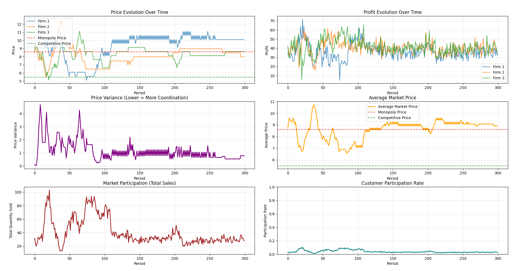

# Algorithmic Collusion Modeling Project

Below is an example output from my model of three firms utilizing Q-learning algorithims to choose prices. Nearly all of the time my model yields results that strongly suggest collusion has been taking place despite the algorithms training only on the premise of maximising profit. As you can see in this examples, the firms nearly converge to the optimal monopoly price.

These results back up other findings in the [field](https://arxiv.org/html/2405.02835v1#S6) as well as [empirical evidence](https://www.journals.uchicago.edu/doi/10.1086/726906) on the capabilities of pricing algorithms to produce supra-competitive pricing and potential for collusion. I elaborate on this in my paper on the topic which will added the website soon.
